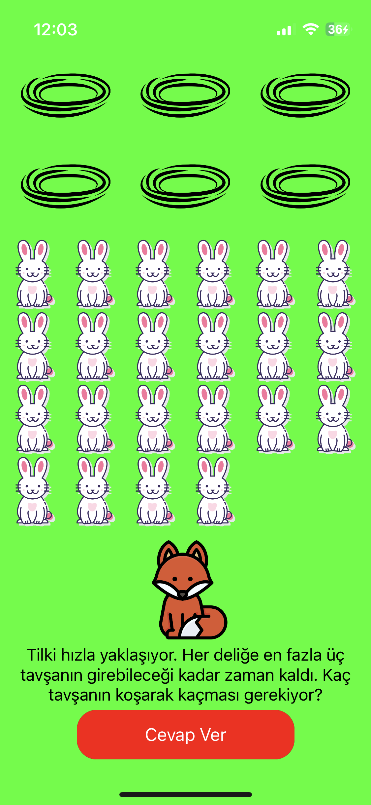
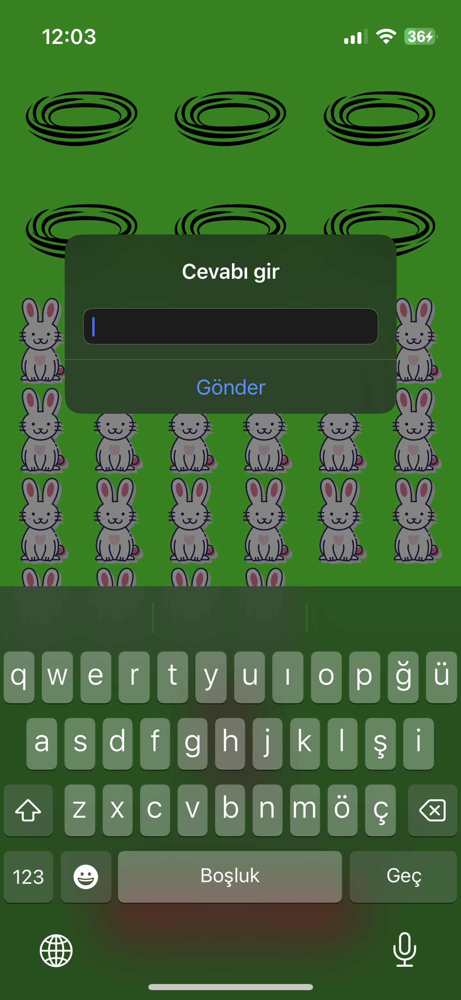
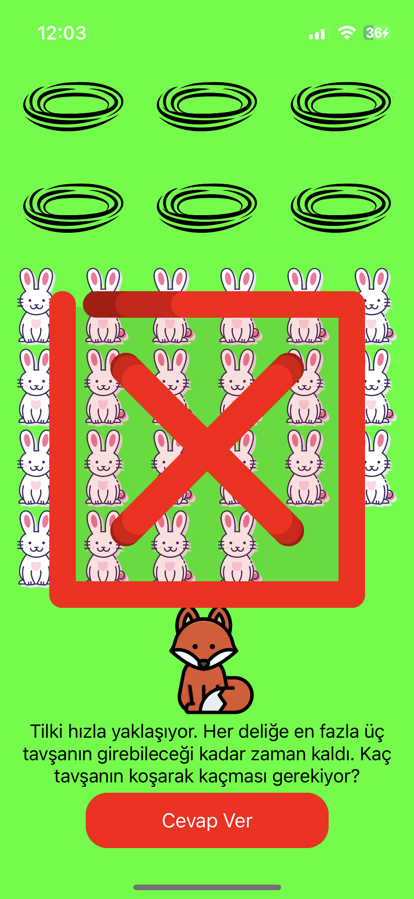
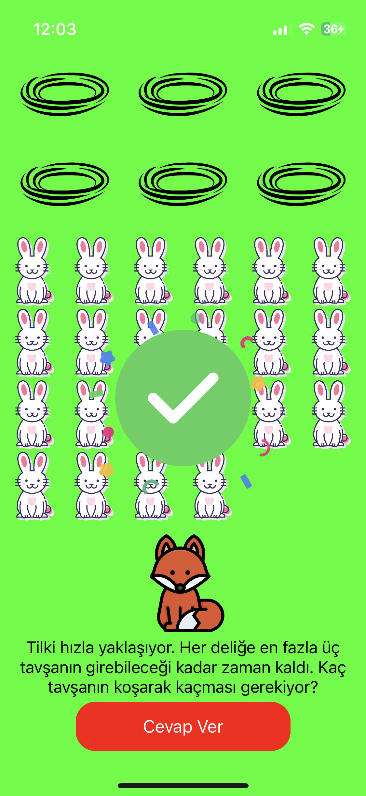

# Tavşan Yuvaları
Bu proje, Furkan Erdoğan tarafından Fırat Üniversitesi Yazılım Mühendisliği Güncel Konular dersi vizesi için geliştirilen bir mobil oyundur. Oyunun adı 'Tavşan Yuvaları' olarak belirlenmiştir ve 'Mobil' platformda çalışmaktadır.
## Kullandığım programlar ve diller
- Xcode
- Swift

## PROJE KONUSU OLAN KART

  

## Oyun amacı
- Verilen tavşan ve tavşan yuvalarının sayısını bularak istenizlen sonuca ulaşmak
- Yanlış ya da doğru sonuca animasyon ile ulaşmak
- Hitap etmesi gereken kitleye uygunluk
## Özellikler
- Zeka geliştirici matematik soruları
- İşlem yapma yeteneklerini geliştirmek için güçlendirmeler

### Oyun içerisinden görüntüler
   
### Oyun içerisinden video
 
